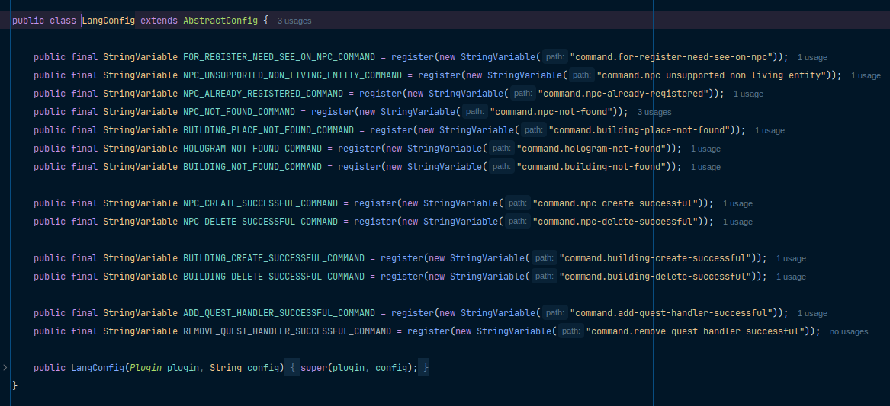

# BedrockLib



**A lightweight configuration library for Spigot plugins** that provides type-safe configuration management through Java classes.

## Features

- **Declarative configuration** - Define config structure using Java classes
- **Type-safe variables** - Supports primitives, strings, Bukkit colors, and custom types
- **Automatic file handling** - Creates config files with default values if missing
- **Runtime reloading** - Hot-reload config values without restart

## Installation

Add the library to your Spigot plugin project:

### Maven
```xml
<repositories>
	<repository>
	    <id>jitpack.io</id>
	    <url>https://jitpack.io</url>
	</repository>
</repositories>
```

```xml
<dependencies>
    <dependency>
        <groupId>com.github.MrBedrockpy</groupId>
        <artifactId>bedrocklib</artifactId>
        <version>2.0.4</version>
    </dependency>
</dependencies>
```

### Gradle (Groovy)
```groovy
repositories {
    mavenCentral()
    maven { url 'https://jitpack.io' }
}
```

```groovy
dependencies {
    implementation 'com.github.MrBedrockpy:BedrockLib:2.0.4'
}
```

### Gradle (Kotlin)
```kotlin
repositories {
    mavenCentral()
    maven { url = uri("https://jitpack.io") }
}
```

```kotlin
dependencies {
    implementation("com.github.MrBedrockpy:BedrockLib:2.0.4")
}
```

### Important
> To work, you need to add the code of this library to the jar file of the build. I am using [shadowjar](https://github.com/GradleUp/shadow).

## Usage

### 1. Create Configuration Class
```java
public class MainConfig extends AbstractConfig {
    public final ColorVariable ERROR_COLOR = register(new ColorVariable("error-color"));
    public final ColorVariable SUCCESS_COLOR = register(new ColorVariable("success-color", Color.BLACK)); // With adding default value

    public MainConfig(Plugin plugin) {
        super(plugin, "config.yml");
    }
}
```

### 2. Initialize in Plugin
```java
public class MyPlugin extends JavaPlugin {

    private MainConfig config;

    @Override
    public void onEnable() {
        config = new MainConfig(this);
    }
}
```

### 3. Getting and setting values
```java
Color color = config.ERROR_COLOR.get();
```

```java
config.ERROR_COLOR.set(newColor);
```

## Advanced Features

### Creating custom type variables
```java
import org.bukkit.Color;
import org.bukkit.configuration.file.FileConfiguration;
import ru.mrbedrockpy.bedrocklib.config.variable.ConfigVariable;

public class ColorVariable extends ConfigVariable<Color> {

    public ColorVariable(String path) {
        super(path, Color.BLACK);
    }

    public ColorVariable(String path, Color defaultValue) {
        super(path, defaultValue);
    }

    @Override
    public Class<Color> getType() {
        return Color.class;
    }

    @Override
    public void load(FileConfiguration config) {
        set(config.getColor(getPath()));
    }

    // Required only for unsupported types in bukkit configuration
    @Override
    public void save(FileConfiguration config) {
        config.set(getPath(), get());
    }
}
```

### Hot reloading
```java
config.save(); // Save changes
config.load(); // Reload from file
```
